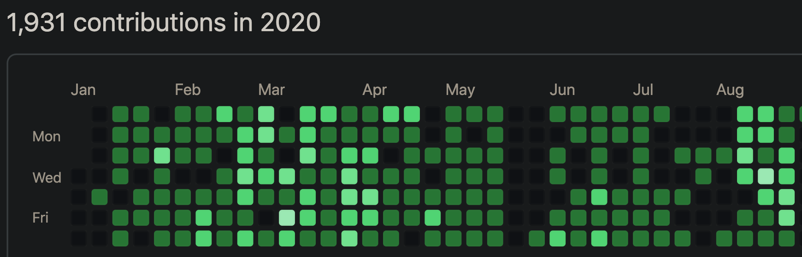

### My logs

* https://gaemin.tistory.com/?page=1
* https://velog.io/@snoop2head

## My Works

* Ghoststation wikipedia (closed due to AWS error)
* Financial Browser Extension (does not work on Chrome)
* [Fitcuration](fitcuration.site)
* [yonsei.exchange](yonsei.exchange)

## My Logs

**Break and Compose**

1930 contributions from Jan 1st to Aug 30th. 
[Top 77th active github user in South Korea](https://commits.top/south_korea.html)

### January

* Peeking at notion-py
  * Realized usable Content CMS is not sufficient on the market -> later on moves on to Gatsby
* Merging my first PR: [nomadcoders golang crawler](https://github.com/serranoarevalo/gojobs/pull/1)
  * Documentation on installation is the most fundamental, but many times cumbersome task
* [Making Exercise Recommendation algorhithm with instagram dataset for Fitcuration](https://github.com/snoop2head/FitCuration) -> [Changed Repository to instagram_hashtag_analysis](https://github.com/fitcuration/instagram_hashtag_analysis)
  * Realized Non-existence of instagram dataset (for Korean lang at least)
* [Making Transcript for Ghoststation](https://github.com/ghoststation/ghoststation_transcript)
  * Realized non-existence of usable Korean transcript API, except for Google Cloud API

### February

* Contributed to COVID19 Prediction Projects: [FB Prophet](https://github.com/kairess/corona-virus-prediction/pull/1) and [Kalman Filter](https://github.com/Rank23/COVID19)
  * Distributing Jupyter environment using Colab is madatory, in order to let other people probe into your code
* [Learning Django with Airbnb Cloning project from Nomad Coders](https://github.com/snoop2head/django_airbnb_cloning_practice)
  * Learning by imitating others' project is the fastest way to get my project done.
* [Making Django web for Fitcuration](https://github.com/snoop2head/FitCuration_django_web)
  * Combining NLP & Web should be done on Docker, in order to distribute & maintain website.
  * It is difficult to find ready-to-made Django projects.
* Learning how to make Chrome extension
  * Browser console (rather than terminal on local) is the fastest way to debug things
* [Learning Express & Node with youtube cloning practice from Nomad Coders](https://github.com/snoop2head/vanilla_javascript_youtube_practice)

### March

* Contributed to [Docker Django Quickstart documentation regarding postgres initialization](https://github.com/docker/docker.github.io/pull/10624) & [Django Wiki Quickstart documentation](https://github.com/django-wiki/django-wiki/commit/fd89aa4047352af8afdbdeef677fb4fbb5d9503d) & [NLP Startups](https://github.com/Huffon/nlp-startups)
  * Django web projects are mostly poorly maintained and lacks reference to build up. Django should be choosen only as the API server.
* 멋쟁이사자처럼 서류 탈락, 디프만 지원. 연세대 창업경진대회 서류 탈락.
  * Choosing an experienced partner is manner for myself.
* [인공지능 데이터셋 경진대회 SelectStar 예선 통과](https://drive.google.com/file/d/1leXJBojlhTe8WLTn-Vna0daFBAdoj2j4/view?usp=sharing) && [인공지능 데이터셋 경진대회 SelectStar 3등 마감](https://drive.google.com/file/d/1T2jtbiG1JyuGbmte-Zbx8MZmed--FJyz/view?usp=sharing)
  * Displaying cute figures on the background often gives good image to the interviewer
* [Gulp Project](https://github.com/snoop2head/gulp-gulp-gulp) & [SCSS practice by cloning bunch of websites & solving problems](https://github.com/snoop2head/scss_practice)
  * Many times, writing things down on README.md is helpful for myself, and the others.
* [Learned how to use Docker](), [Made image with Django & KoNLPY](https://github.com/snoop2head/docker_konlpy_django)
  * Docker enables combination of NLP & Web

### April

* [Finalized Fitcuration Django Web using Django and Konlpy on Docker images](https://github.com/snoop2head/FitCuration_django_web)
* Made [Google Drive Document for Fitcuration <-> PostgreSQL pipeline](https://github.com/snoop2head/FitCuration_docs)
  * Working with non-developer partner should be considered when developping an website
* [Made Velog Images auto uploader: local -> github -> Codepipline -> AWS S3](https://github.com/snoop2head/local_to_s3)
  * Stacking static images on S3 is pretty cheap and easy to use.
* [Learned FastAPI](https://github.com/snoop2head/chatspace_api_flask)
  * FastAPI should replace Flask. Fast && Quick to develop && provides Swagger-like api docs
* BIT 재무세션 진행
  * Taping your lecture on YouTube is great

### May

* [Using KoSpeech for Ghoststation radio program transcription. But documentation was too poor to use](https://github.com/sooftware/KoSpeech/issues/16)
  * Korean STT Models are poorly maintained, difficult to use, can't be used as library such as EasyOCR. 
* [Tried to make Financial Dictionary Chrome Extension](https://github.com/Moneypedia/finance-extension) [but chrome blocked FastAPI server deployed in Google App Engine](https://github.com/Moneypedia/finance-extension-server)
  * Building Chrome extension is for self-serving, shouldn't be considered to be provided as paid service. Non-profitable and vulnerable to browser security policies && updates.

### June

* [Deployed Ghoststation transcript files](https://github.com/snoop2head/ghoststation-storage) in form of markdown, [on wiki.js via github](https://github.com/snoop2head/wiki-js-docker)
  * Saving documents in form of Markdown is useful: both for wiki.js, gatsby, jekyll all adapts markdown files as contents to be displayed on website
  * Text document complexity level:  plain text < Markdown < pug.js <<< HTML
* [Learning Rust lang](https://github.com/snoop2head/lust-for-rust)
  * Rust is awesome. Easy to use, but it will take some time to learn.
* [Switched from pipenv to Pyenv](https://noopy.dev/data/200705_pyenv%EC%99%80_pipenv%EB%A1%9C_%EA%B0%9C%EB%B0%9C_%ED%99%98%EA%B2%BD_%ED%98%BC%EC%84%A0_%EC%A4%84%EC%9D%B4%EA%B8%B0/), partially due to curiosity on [RustPython project](https://github.com/snoop2head/RustPython) and PyPy
  * Conda collides with other environments, and difficult to adapt newly developed packages. Pyenv should be the python version manager, whereas nvm is for the node.
* [Made Korean companies' spinoff event tracker](https://github.com/snoop2head/spinoff_hunter_kor)
  * gspread is the only option for linking with google spreadsheet.
* [Used EasyOCR](https://github.com/snoop2head/EasyOCR_Sample)
  * From paper to libary: Making library that is usable by others (like API) is welcomed by public
* [Found Github Star topic cluster, contributed to initialization](https://github.com/snoop2head/github-stars-by-topic)
  * TFIDF usage on English is often simple and powerful, such as building search rules and sorting topics, whereas TFIDF's usage on Korean lang is limited.

### July ~ August

* Got accepted to YBIGTA
  * Johnny is right about 동아리.
* [Gatsby Starter Bee contribution](https://github.com/JaeYeopHan/gatsby-starter-bee/pull/169), Made [personal blog noopy.dev](https://github.com/snoop2head/noopy) out of it
  * Content CMS framework with 1) mobile adaptability, 2) dark mode, 3) fast, 4) markdown support, 5) Plugins such as Google Analytics, SEO etc... leaves the Gatsby the only option. But it is hard to add search component to Gatsby...
  * React is great since it divides its features on components: easily editable by other contributers.
* [Harvard Stat110 Studying](https://noopy.dev/statistics/stat110/)
* [Deployed Making Yonsei-exchange Program Analysis](https://yonsei-exchange.netlify.app/)
  * Never ever ever change route for the link that went viral on Facebook: I lost 40~50 users because of changing /Europe/ to /Switzerland/, which left the shared link as non-existent link (404).
* [Tracking Unknown paths of infection for Covid19](https://github.com/snoop2head/covid19_unknown_spread)
  * using pandas and matplotlib only can extract viable information: what public doesn't know of
  * %unknown is 20% country wide(on media) vs 30% in Seoul(found by pandas)
* [Baseball Statistics Study](https://github.com/snoop2head/KBO-popcorn)
* [Started to make Velog Syncing with personal blog](https://github.com/snoop2head/velog_sync)

## Future Projects

* Killer hornets from Asia vs Honey bees (Deep Learning)
* Attaching search engine to Gatsby website (Web)
* Search Trendy Emoji
* Topic sorter for Github stars

 