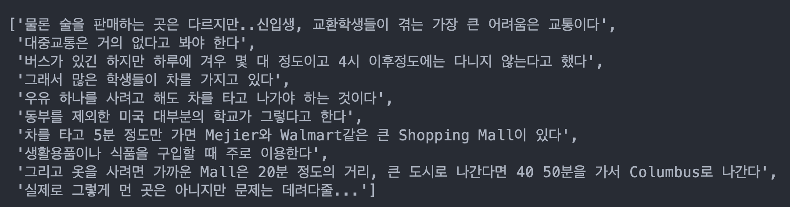
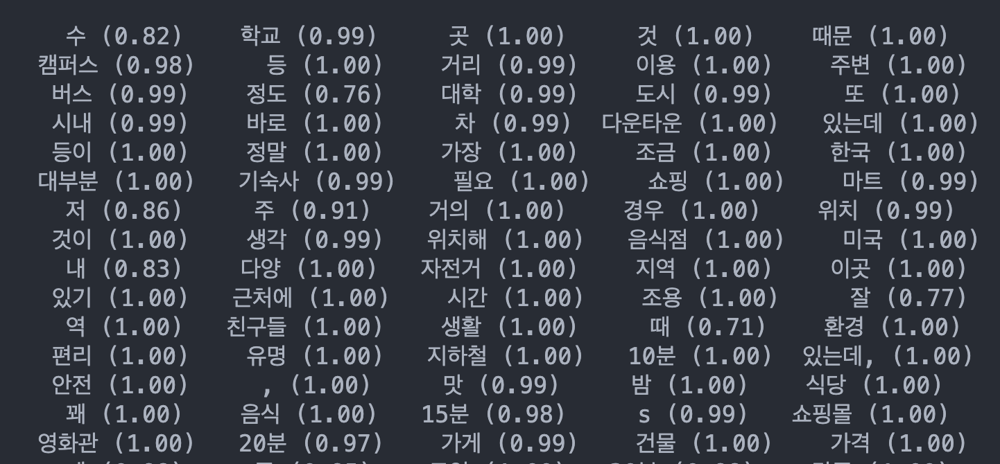
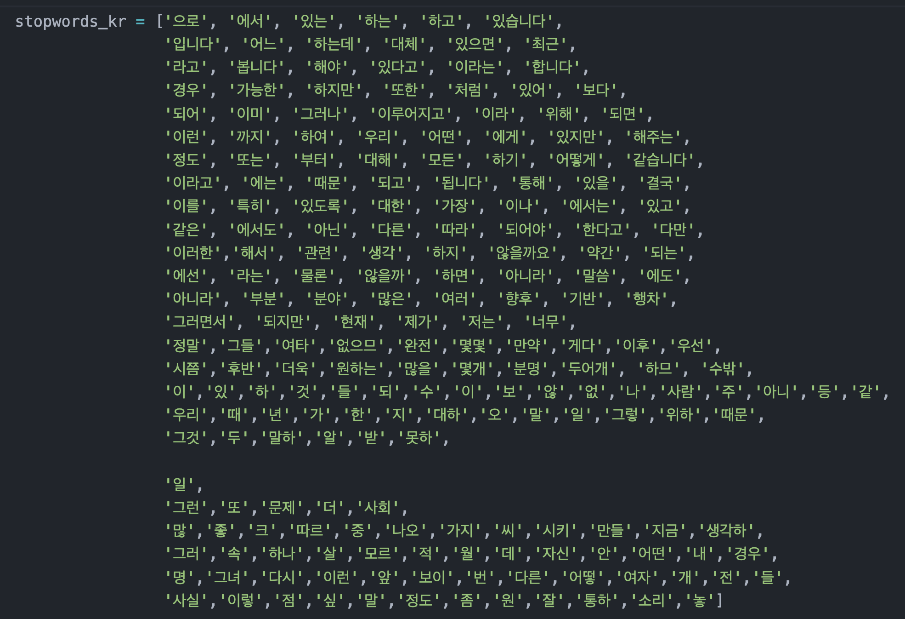
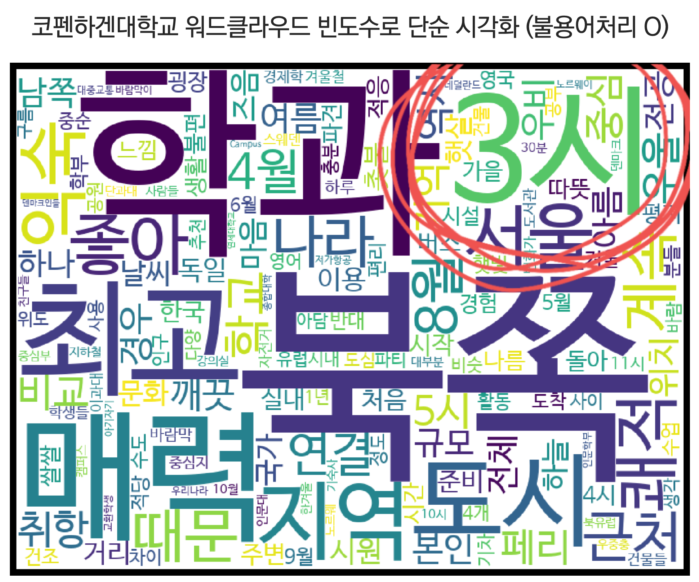
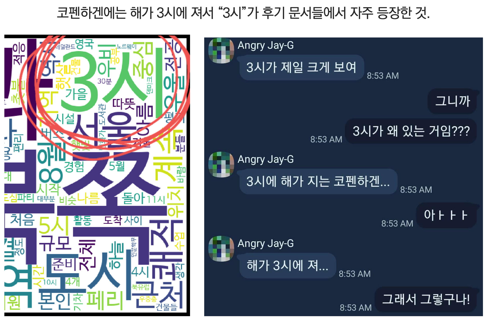

### 프로젝트 소개

2020년 8월 기준 총 11200여 건의 리뷰데이터들을 모아놓음. 각 해외 파견 대학들의 연세대 학생 리뷰 텍스트 데이터를 정리함.

### Slide 1 | Keyword Extraction

학생들은 귀국 직후 아홉 가지 항목에서 질문을 받으며, 각 항목에 대한 학생들의 답변을 각 대학 별로 데이터를 모음. 질문에 대한 응답은 글자수 제한이 없어서 세세한 부분까지 자세하게 작성되어 있음. 종종 영어로도 작성된 후기들이 존재함. 하단은 문장 단위로 나눈 것.

### Slide 2 | Keyword Extraction

각 대학 별로 명사들을 추출한 예시

 ### Slide 3 | 불용어처리 및 향후 키워드 추출 계획

1. Column corpus에서 frequency 높은 단어들 mecab/Okt로 추출해낸 list 상위 100개를 stopword로 만들고, university[column]에서 frequency 높은 것들 추출해낸 것들 중에서 빼내기
2. Column corpus에서 frequency 높은 단어들 mecab/Okt로 추출해낸 list 상위 100개를 stopword로 만들고, university[column]에서 TextRank 먹인 리스트에서 빼내기

### Slide 4 | 향후 워드클라우드 제작

### Slide 5 | NSMC Corpus로 레이블링하기

네이버 영화리뷰 평점으로 긍부정 분류

### Slide 6 | NSMC Corpus로 train시킨 BERT로 레이블링하기

### Slide 7 | NSMC Corpus로 train시킨 RNN으로 레이블링

### Slide 8 | BERT와 RNN으로 매긴 점수를 합산해서 대학 순위 산정

