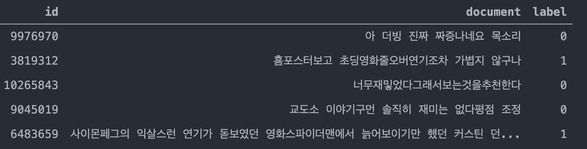
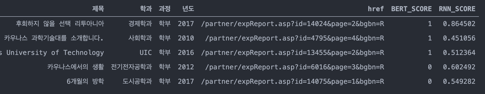
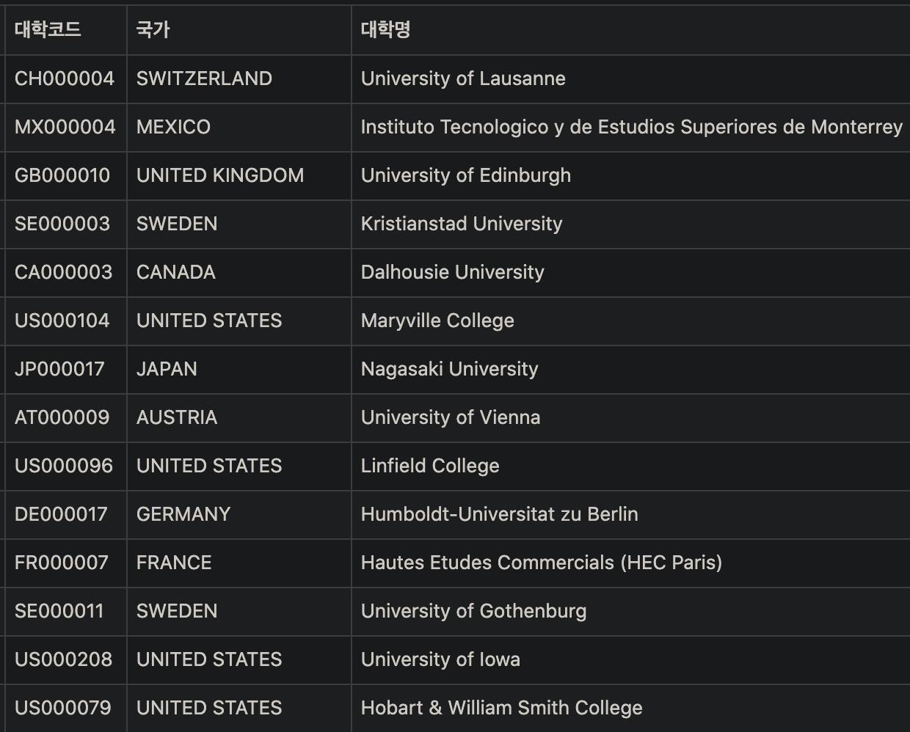

### SoyNLP를 이용한 L-R

### NSMC Corpus로 레이블링하기

네이버 영화리뷰 평점으로 긍부정 분류

-----

NSMC Corpus로 train시킨 BERT로 레이블링하기

-------

NSMC Corpus로 train시킨 RNN으로 레이블링

----------

BERT와 RNN으로 매긴 점수를 합산해서 대학 순위 산정

