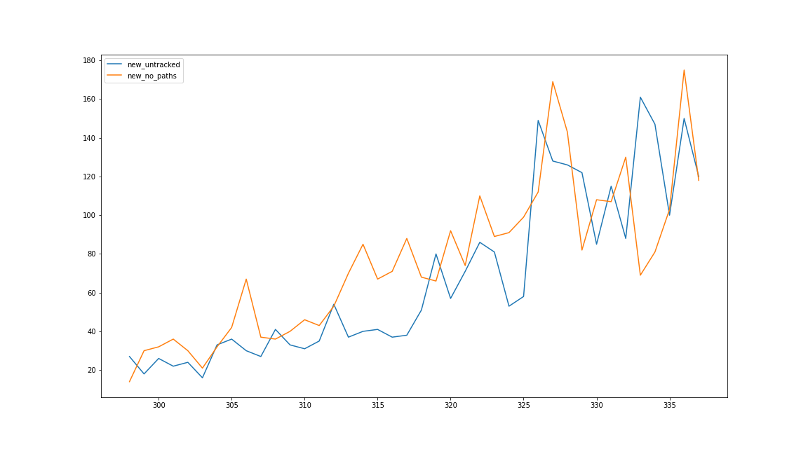
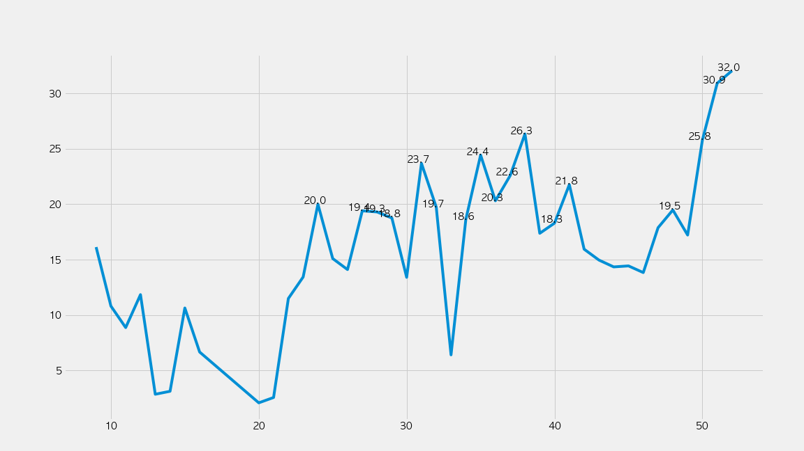
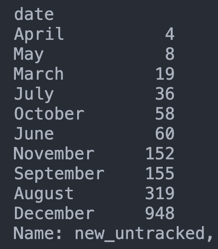
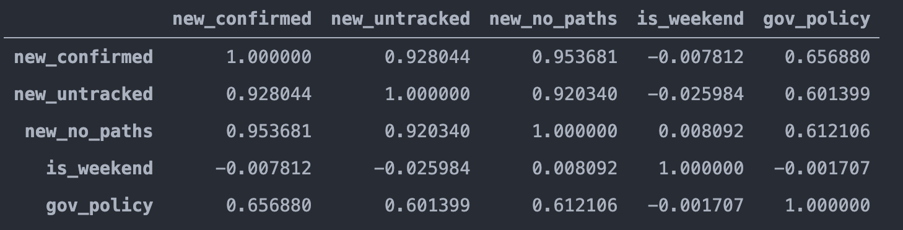
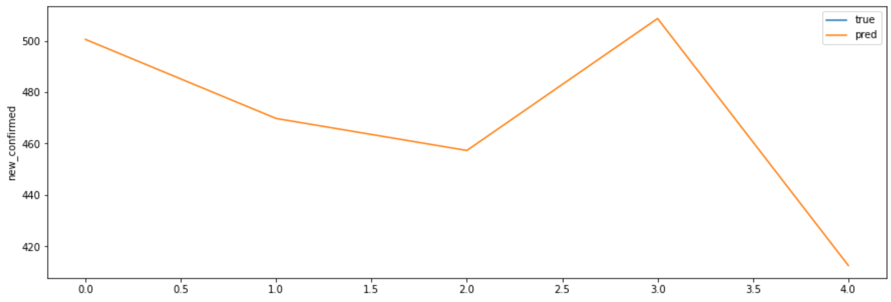

## 12월 28일자 확진자 현황 분석

최근 40일 동안의 서울시 확진자 데이터를 알아보자. 파란색 선은 감염 경로불명 확진자 수이다. 노란색 선은 역학조사로 밝혀낸 감염 경로 개수이다. X축은 날짜이며, Y축은 확진자 수이다. 파란색 선이 노란색 선의 선행지표인 것처럼 보인다. 어디서 걸렸는지도 모르는 사람들(파란색)이 증가할 수록, 감염이 더 많은 집단(노란색)으로 퍼진다는 의미이다. 이는 상식에서 크게 벗어나지 않는다.

문제는 서울시에서 감염경로 불명 확진자의 비율이 폭증했다는 점이다 ㅠㅠ 첫 번째 그래프는 일 단위로 확진자 수를 쪼갠 거라서 아무래도 변동이 있다. 그런데 두 번째 그래프에서 일주일 단위로 쪼개보면, 경로 불명 확진자 비율이 최근 5주 동안 상승세를 계속 유지했음을 알 수 있다.

경로불명확진자 수는 지난 달에 비해서 6배 가까이 뛰었다는 것이다. 광복절 집회로 크게 문제가 됐던 8월의 3배 가까이 뛰었다.

감염 경로불명 확진자 수와 감염 경로 개수는 0.920의 상관관계를 갖는다. 또한 감염자 수는 1) 경로불명 감염자수와 2) 감염 경로 개수와 각각 0.928, 0.954의 높은 상관관계를 갖는다. 하지만 여기서 상식과는 다르게, 오히려 주말이 확진자수와 거의 관계가 없다는 결과가 도출됐다. 이는 감염시점과 확진시점이 다르기 때문이다. 실제로 감염 이후 증상 발현은 중간값이 5일 정도라고 한다. 따라서 여기에서 시계열 분석의 필요성이 제기된다.

확진자 추이를 예측해보니, 앞으로 5일 동안은 400명에서 500명 대를 계속 왔다갔다할 것 같다. LSTM을 이용한 timeseries forecasting으로 예측해봤다. 총 다섯 개 데이터를 넣어서 예측을 해봤다: 1) 총확진자수 2) 감염경로불명 확진자수 3) 감염경로 개수 4) 주말 여부 5) 공휴일 여부를 넣었다. 

`코드 및 이미지 출처: https://github.com/snoop2head/covid19_unknown_spread`